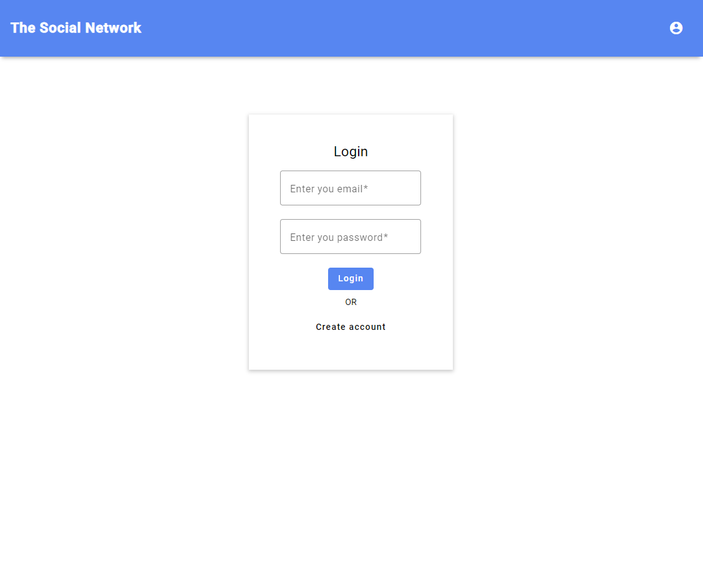
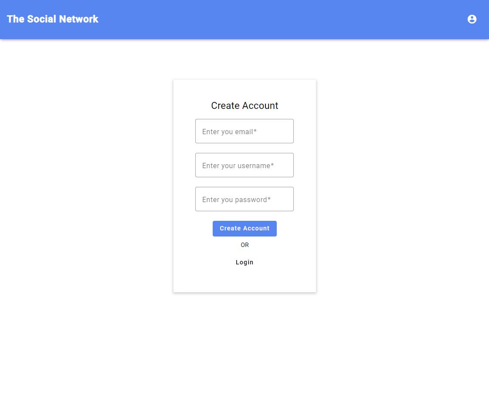

<div id="top"></div>

<!-- PROJECT LOGO -->
<br />
<div align="center">
<a href="https://lab.skynetinc.tech/WorldDrknss/Social.Network"><h3 align="center">The Social Network</h3></a>

  <p align="center">
    <br />
    <br />
    <a href="https://lab.skynetinc.tech/WorldDrknss/Social.Network/issues">Report Bug</a>
    ·
    <a href="https://lab.skynetinc.tech/WorldDrknss/Social.Network/issues">Request Feature</a>
  </p>
</div>


<!-- ABOUT THE PROJECT -->
# About The Project

[![Product Name Screen Shot][product-screenshot]](https://lab.skynetinc.tech/WorldDrknss/Sky.Net)

Login Page                 |  Create Account Page
:-------------------------:|:-------------------------:
      |  

Social Network

* Angular
* Google Firebase Storage
* Repository and Unit of Work Pattern
* Angular Routing
* Angular Firebase
* Angular Reactive Forms
* Angular Re-usable form components
* Angular validation and async validation

<p align="right">(<a href="#top">back to top</a>)</p>


### Built With

* [NodeJS](https://nodejs.org/)
* [Angular](https://angular.io/)

<p align="right">(<a href="#top">back to top</a>)</p>


<!-- GETTING STARTED -->
# Getting Started

To get a local copy up and running follow these simple example steps.

### Prerequisites

This is an example of how to list things you need to use the software and how to install them.

* npm
  ```sh
  npm install npm@latest -g
  ```
* Angular
  ```sh
  npm install -g @angular/cli
  ```

### Installation

1. Clone the repo
   ```sh
   git clone https://lab.skynetinc.tech/WorldDrknss/Social.Network.git
   ```
2. Install NPM packages
   ```sh
   cd client
   npm install
   ```

3. Add the following in src/environments/ `environments.prod.ts` and `environments.ts`
   ```js
    apiKey: '<your-key>',
    authDomain: '<your-project-authdomain>',
    databaseURL: '<your-database-URL>',
    projectId: '<your-project-id>',
    storageBucket: '<your-storage-bucket>',
    messagingSenderId: '<your-messaging-sender-id>',
    appId: '<your-app-id>',
    measurementId: '<your-measurement-id>'
   ```
7.  Start the development servers
    ```sh
        json-server --watch mock-api/data.json
        ng server
    ```

<p align="right">(<a href="#top">back to top</a>)</p>

<!-- LICENSE -->
# License

Distributed under the MIT License. See `LICENSE` for more information.

<p align="right">(<a href="#top">back to top</a>)</p>


<!-- CONTACT -->
# Contact:

Twitter - [@skynetinctech](https://twitter.com/skynetinctech)

Linkedin - [Charles Showalter](https://linkedin.com/in/charles-showalter)

Instagram - [@skynetinc.tech](https://twitter.com/skynetinc.tech)

Facebook - [@skynetinctech](https://facebook.com/skynetinctech)

Project Link: [https://lab.skynetinc.tech/WorldDrknss/Social.Network/](https://lab.skynetinc.tech/WorldDrknss/Social.Network/)

<p align="right">(<a href="#top">back to top</a>)</p>


<!-- MARKDOWN LINKS & IMAGES -->
<!-- https://www.markdownguide.org/basic-syntax/#reference-style-links -->
[twitter-shield]: https://img.shields.io/twitter/follow/skynetinctech?style=for-the-badge
[twitter-url]: https://twitter.com/skynetinctech
[linkedin-shield]: https://img.shields.io/badge/-LinkedIn-black.svg?style=for-the-badge&logo=linkedin&colorB=555
[linkedin-url]: https://linkedin.com/company/skynetinc
[product-screenshot]: images/application.PNG